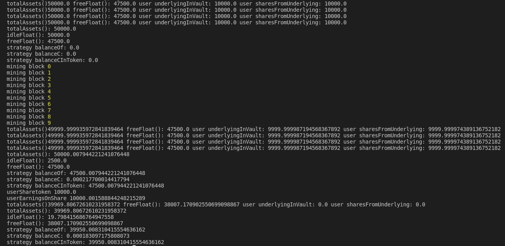

# About
BREAD PROTOCOL

What is Bread protocol?

Bread protocol is a public, open-source, proof-of-work, inflation-stable coin. The VaultContract is the reference implementation of the Bread protocol written in Solidity.****

Problem we’re solving

Stable coins are great for creating a familiar unit of account on chain, but how does a typical person protect their hard-earned money from the erosion of inflation in an accessible way?

How we’ve addressed the problem

Our vision is for an inflation resistant coin that can be purchased by anyone. They would be able to buy the coin and then retain their purchasing power without any of the complications of maintaining an investment.

We target to preserve present day purchasing power by earning yield at a rate that matches Truflation (a decentralized inflation statistic). A minter deposits an asset, DAI for now, to earn the yield necessary to match the decay of Truflation. We accomplish that by increasing the collateral required to back every ISUSD. The more collateral backing ISUSD, the more yield earned to combat higher inflation.

Used technologies

The VaultContract is powered by
1. Ethereum blockchain
We use Ethereum blockchain because it’s secure, decentralized & reliable
2. Truflation
The big differences between Bread Protocol compared to other IRSC’s are we are not algorithmically pegging to truflation, only targeting it. We target to preserve 2022 purchasing power by earning yield at a rate that matches truflation.
3. ERC-4626
By using a Vault Standard for our contract, we leave open possibilities for more future interoperability and general ecosystem cohesiveness.

BREAD PROTOCOL
Our Intention to build Bread Protocol came before Terra Luna and stable-coins became the epicenter of dialogue, the narrative from our industry, and wider financial markets. Due to real life factors many of us live in a world where Inflation is directly impacting our lives. Members of our team have experienced hyperinflation in the last few years in their home countries, seen political, economic and personal problems develop from inflation.
Upon the discovery of Truflation & their collaboration with the Chainlink Hackathon, we figured It would be beneficial to take this opportunity posed through the hackathon to tackle an immense problem. We had wanted to figure out a novel way to incorporate Truflation Data On-chain, walked through a few project Ideas that included an idea utilizing dynamic nft’s that change in response to Truflation’s data, but ultimately decided to reach for the stars and try to build a protocol that helps users hedge against inflation itself. We may have taken a big bite, however our learning experiences can and should be documented. We originally looked into ways to buy synthetic assets which represented commodities - the true assets behind rising inflation. We looked into how other protocols algorithmically produced pegs to a certain price point, whether through creating an algorithmic version of the IMF-SDR or through rebasing supply in all token holder’s wallets. We had considered that while impressive and some of these tools and approaches seemed to “get the job done” we worried about what lived underneath these approaches. Ever so fearful of a depegging incident we considered how it would look to approach this problem through over-collateralization and relying on market forces & conditions to create a hedge against inflation.
We decided to follow a model similar to DAI - which relies on market forces and over-collateralization. To mint DAI you must deposit between 150% - 350% collateral into a vault. Once you do, the smart contract mints DAI (which is a stable coin) to your wallet. An individual can use DAI to earn income through the use of various defi protocols and pools - while still retaining the appreciation value of their collateral.
Our approach differs by utilizing a new ERC-standard called ERC-4626 which creates a Vault. Integrates Truflation data & considers available yields in different strategies to provide a variable-collateralization rate. The user then mints their ISUSD at a collateralization rate that relies on Truflation’s data & Yield to produce a collateralization between 200-350%. After producing simulations of past inflation data ranging back 50 years 1000 times we came to the conclusion that xxx factors could produce a positive outcome. Here is the bar graph detailing these simulations.

We were unable to get Truflation’s data directly integrated to our vault contract - however we were able to produce a truflation-data retrieving contract that was also Chainlink Keeper’s Compatible - it has been deployed to Rinkeby at 0x67b305Cd36e7335B44d0c2a89edC1f898Defc63c Address. The Upkeep contract can be found at 0x409CF388DaB66275dA3e44005D182c12EeAa12A0 Address. Note that the upkeep contract for the wider project was intended to be ran every 84,600 seconds (or 1 day) as the Truflation data-set is aggregated once a day & there was no need for redundancy. For testing purposes the Deployed Truflation-KeepersCompatible Contract was ran at an upkeep interval of 30 seconds.


The Vault works as described in the video here - https://youtu.be/EGmxkH5z7ok


---- This is the documentation from the ERC-standard that we forked ---- 
This repository is an example of Yearn V2 Vault architecture translated into new ERC-4626 proposed standard for Vaults. Yearn Vault contract is exchanged with minimal implementation of [Rari's solmate](https://github.com/Rari-Capital/solmate) ERC-4626. Controller and Strategy contracts are left untouched. Basic DAI/Compound stategy is used because of it's simplicity. Some functions from original Yearn Vault got rewritten to operate with underlying ERC-4626, that is usually noted through NatSpec's @notice tag. Contract is neither tested nor optimized.

All is run against forked network with real DAI used and actual compounding from Compound. Console.log will return internal balance sheet change (interests accrued) after depositing funds into strategy and waiting some blocks for profit.

This is by no means robust simulation but could be extended easily. As is, you can just verify that Yearn V2 works fine with ERC4626 through inspection of a small change in accured profits from Compound strategy. 



### To do / Future

1. Yearn is an example of aggregator vault. It would be interesting to build lending (aave) or options (ribbon) vault minimal example.
2. Stablecoins / Pegged tokens could also be a target of vault-fun.
3. Swap-like pools, e.g Balancer.

# How to run

Set `.env.example`

`yarn install`

First, start the hardhat network: `npx hardhat node`

To simulate deployment and deposits run: `npx hardhat run scripts/simulate.ts --network localhost`

There is currently no test beyond basic deployment of Vault + Strategy to a local hardhat network.

# Resources

ERC4626 Proposal: https://github.com/ethereum/EIPs/blob/master/EIPS/eip-4626.md

Yearn V2 Contracts: https://github.com/yearn/yearn-starter-pack

ERC4626 Discussion: https://ethereum-magicians.org/t/eip-4626-yield-bearing-vault-standard/7900/45

# Solidity Template

Uses

- [Hardhat](https://github.com/nomiclabs/hardhat): compile and run the smart contracts on a local development network
- [TypeChain](https://github.com/ethereum-ts/TypeChain): generate TypeScript types for smart contracts
- [Ethers](https://github.com/ethers-io/ethers.js/): renowned Ethereum library and wallet implementation
- [Waffle](https://github.com/EthWorks/Waffle): tooling for writing comprehensive smart contract tests
- [Solhint](https://github.com/protofire/solhint): linter
- [Prettier Plugin Solidity](https://github.com/prettier-solidity/prettier-plugin-solidity): code formatter

This is a GitHub template, which means you can reuse it as many times as you want. You can do that by clicking the "Use this
template" button at the top of the page.

## Usage

### Pre Requisites

Before running any command, make sure to install dependencies:

```sh
$ yarn install
```

### Compile

Compile the smart contracts with Hardhat:

```sh
$ yarn compile
```

### Test

Run the Mocha tests:

```sh
$ yarn test
```

### Deploy contract to netowrk (requires Mnemonic and infura API key)

```
npx hardhat run --network rinkeby ./scripts/deploy.ts
```

### Validate a contract with etherscan (requires API ke)

```
npx hardhat verify --network <network> <DEPLOYED_CONTRACT_ADDRESS> "Constructor argument 1"
```

### Added plugins

- Gas reporter [hardhat-gas-reporter](https://hardhat.org/plugins/hardhat-gas-reporter.html)
- Etherscan [hardhat-etherscan](https://hardhat.org/plugins/nomiclabs-hardhat-etherscan.html)

## Thanks

If you like it than you soulda put a start ⭐ on it 
